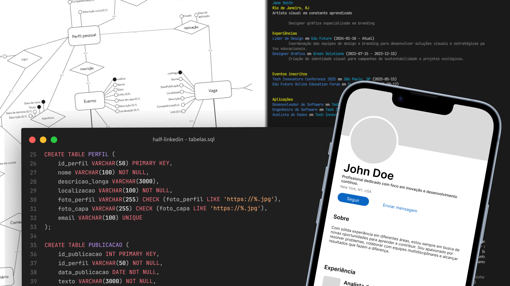

# Projeto de Banco de Dados: ½LinkedIn



Este projeto foi realizado como parte do trabalho prático da disciplina *Fundamentos de Banco de Dados*, sob a orientação da professora *Karin Becker*. O objetivo principal foi aplicar conhecimentos essenciais de Banco de Dados, como modelagem conceitual, projetos lógicos utilizando PostgreSQL, além de técnicas de consultas, gatilhos, procedimentos armazenados e acesso via programa.

Durante o desenvolvimento, foi criado um banco de dados relacional para um LinkedIn fictício, uma rede social simulada que conecta pessoas e empresas. As funcionalidades implementadas no sistema incluem perfis, publicações, eventos, vagas de emprego e interações entre usuários, visando replicar os principais recursos de uma rede social profissional.
  
## Estrutura do Projeto
O trabalho está dividido em três etapas principais:

### Etapa I: Modelagem Conceitual
Foco no planejamento do banco de dados, considerando as necessidades do sistema.

- **[Diagrama ER](/etapa-i/Diagrama%20ER.pdf):** Criação de um Diagrama Entidade-Relacionamento para representar os requisitos do sistema.
- **[Dicionário de Dados (DD)](/etapa-i/Dicionário%20de%20Dados.pdf):** Documentação detalhada das entidades, atributos e relacionamentos.
- **[Descrição do Universo de Discurso (uDd)](/etapa-i/Descrição%20do%20UdD.pdf):** Definição do escopo e regras de negócio do sistema.
  
### Etapa II: Projeto Lógico e Consultas

Transformação do modelo conceitual em um esquema relacional adequado a um Sistema de Gerenciamento de Banco de Dados (SGBD).
  
- **Projeto Lógico:** Implementação do banco de dados em um SGBD relacional.
    - **[Script SQL para criação do banco](/etapa-ii/tabelas.sql):** Criação das tabelas, chaves primárias e estrangeiras.
    - **[Instâncias](/etapa-ii/instancias.sql):** Exemplos de instâncias do banco de dados.
- **Consultas SQL:** Elaboração de consultas que atendam aos requisitos do sistema e demonstrem a funcionalidade do banco de dados.
    - **[Consultas](/etapa-ii/consultas.sql):** Consultas SQL envolvendo as tabelas do banco de dados em diversas complexidades, usando cláusulas de junção, agregação, sub consultas, etc.
 
### Etapa III: Implementação e Apresentação

Construção de funcionalidades avançadas e integração do banco com um programa funcional.
 
- **[Gatilhos (Triggers)](/etapa-iii/gatilho.sql):** Desenvolvimento de gatilhos para automação de processos dentro do banco. Foram criados gatilhos para atualização de visualizações e controle de integridade.
- **[Programa de Acesso](/etapa-iii/programa):** Implementação de um programa que interaja com o banco de dados. Foi utilizado Python e a biblioteca psycopg2 para realizar consultas e atualizações no banco.

## Como Executar

Para executar o projeto, é necessário ter Docker e Docker Compose instalados. Com ambos instalados, basta executar o comando:

```bash
docker-compose up -d
```
O banco de dados será inicializado e estará disponível para conexões. Para acessar o banco de dados, utilize o comando abaixo que abrirá o programa desenvolvido na etapa III:

```bash
py etapa-iii/programa/main.py
```

## Conclusão

O projeto foi uma oportunidade de aplicar conceitos teóricos de Banco de Dados em um cenário prático, permitindo a compreensão de como um banco de dados é projetado, implementado e utilizado em um sistema real. A experiência foi enriquecedora e proporcionou um aprendizado significativo sobre o funcionamento de um SGBD relacional.
